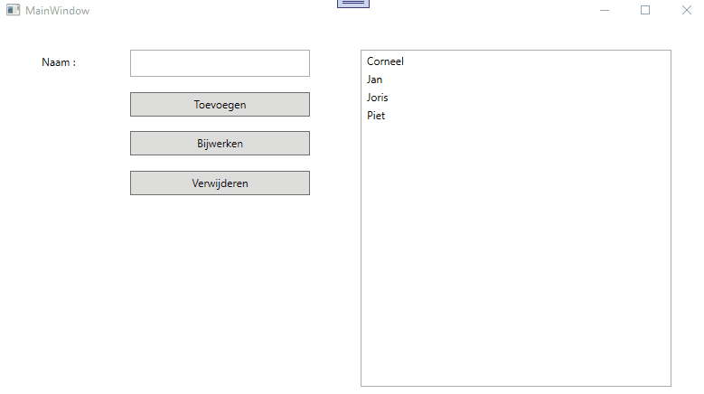

# Lussen en collecties : oefening 3  

Nadat je de code hebt binnengehaald bestudeer je eerst even de controls die zich op het venster bevinden zodat je weet welke controls er zijn en hoe ze heten.  

Vooraleer je begint te programmeren, bekijk aandachtig deze korte demo : 

  
  
Maak eerst een globale List van strings aan (bv List<string> namen) die je straks in alle event-handlers kunt gebruiken.

Tijdens de opstart van je programma dien je  
  
  * een aantal testgegevens toe te voegen aan deze list (= seeding)
  * de listbox te vullen met alle namen die zich in deze List bevinden.  Zorg er ook voor dat de namen alfabetisch gerangschikt zijn
  
Je zorg er eveneens voor dat lblFout bij opstart onzichtbaar wordt gemaakt.  
  
De bedoeling is dat   
  * je een nieuwe naam aan de List (en daarna aan de listbox) kunt toevoegen.  Je voert in txtNaam een nieuwe naam in en je klikt vervolgens op btnToevoegen.  
    De nieuwe naam mag pas toegevoegd worden wanneer je zeker bent dat deze naam niet in gebruik is.  
    Het mag geen verschil uitmaken of de naam met hoofd of kleine letters geschreven wordt : dubbele namen zijn niet toegelaten.  
    Lege namen worden niet toegelaten.  
    Je zorgt - indien nodig - voor een aangepast foutmelding in lblFout.  
    Als een nieuwe naam werd toegevoegd zorg je er voor dat deze eerst in de List wordt toegevoegd en je zorgt er voor dat de listbox gevuld wordt met de nieuwe situatie.  
  * je een bestaande naam kunt aanpassen.  Je selecteert eerst in de listbox de naam die je wil wijzigen.  Deze naam verschijnt dan in txtNaam.  
    Vervolgens wijzig je de naam in txtNaam en klik je op btnBijwerken.  
    De naam mag uiteraar opnieuw niet leeg zijn.  
    Je mag de naam niet veranderen in een (andere) naam die reeds in de List aanwezig is.  
    Je zorgt - indien nodig - voor een aangepast foutmelding in lblFout.    
    Is alles in orde, dan wijzig je de naam in de List en vervolgens zorg je er voor de de listbox opnieuw gevuld wordt met de nieuwe situatie.  
  * je een naam uit de lijst kunt verwijderen.  Je selecteert eerst in de listbox de naam die je wil wissen en vervolgens klik je op btnVerwijderen.  
    De naam dient eerst uit de List verwijderd te worden, en vervolgens zorg je er voor dat de listbox opnieuw gevuld wordt met de nieuwe situatie.  
